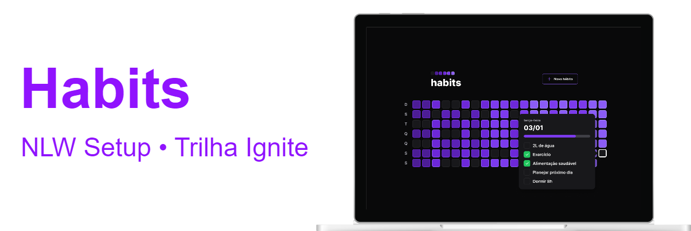

# Habits • Rastreador de hábitos `<NLW Setup/>`

## Sobre

**habits** é um aplicativo projetado para ajudar você a rastrear seus hábitos e melhorar sua qualidade de vida. Com ele, você pode criar uma lista de hábitos que deseja incorporar em sua rotina diária e marcá-los a medida que os pratica.

O aplicativo apresenta um quadro diário que mostra a frequência dos hábitos praticados, permitindo que você veja sua progresso ao longo do tempo e se motive a seguir em frente.

## Aulas

  
16/01/2023 • <b>Iniciando o projeto de ponta a ponta</b>

    Foi ensinado de forma rápida a base dos 3 apps que serão desenvolvidos. Logo no início foi apresentado a configuração do servidor com a biblioteca fastify, em seguida a criação com projeto React com Vite e o uso do Tailwind e por último, a criação e configuração do app mobile com Expo e React Native.

  
17/01/2023 • <b>Avançando o back-end e front-end</b>

    Foi ensinada a criação de rotas no backend e também a validação de dados com zod e integração ao banco de dados com prisma. No Frontend foi criado novos componentes e ensinado técnicas para lidar com datas e resolver dificuldades específicas do projeto. Por último no app mobile, a utilização do Nativewind para estilização como a do Tailwind na web, também foram adicionados componentes novos e reaproveitado algumas funções da web para lidar com datas.

  
18/01/2023 • <b>Finalizando o layout web e mobile</b>

    Foram concluídas as últimas duas rotas do backend e ensinado o momento certo de se compor query SQL a mão. No frontend foi ensinado o uso da biblioteca Radix-UI para criação de componentes com acessibilidade pré configurada e técnicas para estilização com classes condicionais usando o pacote clsx. Por último no app mobile foi ensinado a criação de novas telas e a navegação usando o React Navigator, também foi ensinado a passar propriedades por contexto entre rotas.

  
19/01/2023 • <b>Conectando a API</b>

    Nessa aula o foco foi nos dois projetos frontend, web e mobile. Foi ensinado a buscar dados da API construída no backend usando o useEffect e axios, assim como a transmissão de dados do formulário para a API e toda a integração dos dados recebidos para compor a interface do app web. No app mobile foi feito um processo muito semelhante onde os dados do backend foram conectados com a interface e as informações do formulário de criação de hábito transmitidas para API.

  
20/01/2023 • <b>O próximo nível</b>

